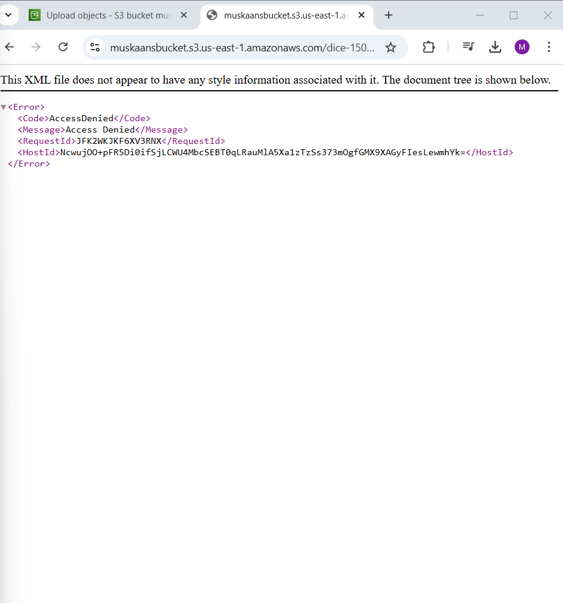

# CODETECH
AWS Cloud 

# 📌 Cloud Storage Setup Guide

## 🎯 Deliverable:

- ✅ A cloud storage bucket is created.
- ✅ Example files are uploaded.
- ✅ Access permissions are configured.

---

## 🛠 Option 1: Setup on AWS S3

### Step 1: Sign in to AWS S3

Go to the AWS Management Console: [AWS Console](https://aws.amazon.com/console/)

Click on "Sign In" (or create an AWS account if you don’t have one).

In the AWS Console, search for "S3" and open it.

### Step 2: Create an S3 Bucket

- Click "Create Bucket".
- Enter a unique bucket name (e.g., `muskaansbucket`).
- Choose a region (select the one closest to your users).
- Block Public Access (default settings; uncheck if you need public access).
- Click "Create bucket".

### Step 3: Upload Example Files

- Open your S3 bucket.
- Click "Upload" → "Add files".
- Select any sample file (e.g., `example.txt` or `image.png`).
- Click "Upload".

### Step 4: Configure Access Permissions

#### Make File Public (Optional):

- Click on the uploaded file.
- Go to the **Permissions** tab.
- Click "Edit" → Uncheck "Block Public Access" (if needed).
- Click "Save Changes".
- Copy the File URL for sharing.




---

## ✅ AWS Deliverables Check

- ✔ S3 Bucket Created
- ✔ Example File Uploaded
- ✔ Permissions Configured

---

# 📌 Object Creation & Policy Modification in Cloud Buckets

## 🛠 1. AWS S3: Object Creation & Policy Changes

### Step 1: Upload an Object (File) Inside an S3 Bucket

- Sign in to AWS Console → Open **S3 Service**.
- Click on the bucket name where you want to add objects.
- Click "Upload" → "Add Files".
- Select a file (e.g., `example.txt`, `image.png`).
- Click "Upload" to store the object inside the bucket.

### Step 2: Modify Bucket Policy (Public Access or Role-Based Access)

#### ➡️ Option 1: Making the Bucket Public (If Allowed)

- Open your **S3 bucket settings**.
- Go to **Permissions** → Click **Bucket Policy**.
- Paste the following JSON bucket policy to allow public read access:

```json
{
  "Version": "2012-10-17",
  "Statement": [
    {
      "Sid": "PublicReadGetObject",
      "Effect": "Allow",
      "Principal": "*",
      "Action": "s3:GetObject",
      "Resource": "arn:aws:s3:::your-bucket-name/*"
    }
  ]
}
```

- Click **Save Changes**.

🚨 **Security Note:** Making a bucket public allows anyone to access the files. Use IAM roles instead if security is a concern.


#### ➡️ Option 2: Granting Specific User Access via IAM Policies

- Go to **AWS IAM (Identity & Access Management)**.
- Click **Policies** → **Create Policy**.
- Select "JSON" tab and add:

```json
{
  "Version": "2012-10-17",
  "Statement": [
    {
      "Effect": "Allow",
      "Action": "s3:ListBucket",
      "Resource": "arn:aws:s3:::your-bucket-name"
    },
    {
      "Effect": "Allow",
      "Action": "s3:GetObject",
      "Resource": "arn:aws:s3:::your-bucket-name/*"
    }
  ]
}
```

- Click **Review Policy** → Name your policy → Click **Create Policy**.
- Attach this policy to IAM users, groups, or roles.


---

## ✅ AWS Deliverables Check

- ✔ Object (file) uploaded inside the bucket
- ✔ Bucket policy updated (public access or IAM role assigned)
